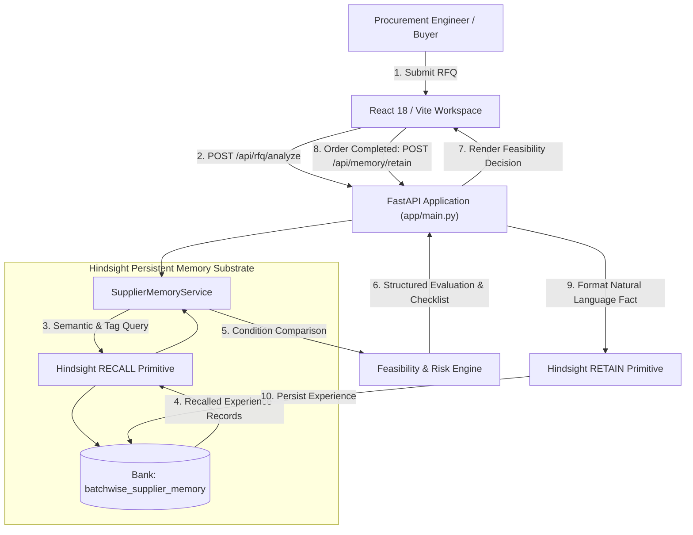

# Experience-Aware Procurement: Condition-Based Supplier Selection Using Hindsight Persistent Memory in Small-Batch Manufacturing

**Author:** BATCHWISE Engineering & Research  
**Document Type:** Technical Architecture & Evaluation Article  
**Status:** Benchmark-Validated Proof-of-Concept  

---

## 1. Abstract

Standard procurement systems evaluate suppliers against static capability directories, equipment lists, and unconditioned quotes. In high-mix, low-volume (HMLV) small-batch manufacturing, this produces recurrent fulfillment failures. Machine shops accept purchase orders based on nominal capabilities, only to encounter cost blowouts from tooling setup or schedule collapse when orders clash with unstated operational constraints. 

BATCHWISE bridges this gap using Vectorize's Hindsight persistent memory architecture. By retaining realized order pricing, lead-time variance, material stock availability, and failure modes, BATCHWISE recalls operational context during new request-for-quotation (RFQ) evaluations. The system contrasts historical operational envelopes to produce a three-state feasibility classification: `FEASIBLE`, `CONDITIONAL` (with an isolated decision-changing condition and verification checklist), or `INSUFFICIENT EVIDENCE`. In a controlled synthetic benchmark of 25 small-batch RFQs across six suppliers, BATCHWISE achieved 88.0% decision accuracy (22/25) versus 48.0% (12/25) for a memory-blind baseline, successfully detecting 100.0% of hidden conditional risks (7/7) and unverified supplier scopes (6/6).

---

## 2. The Problem: Capability Is Not the Same as Fulfillment

In enterprise procurement, supplier qualification relies primarily on static attribute matching: machinery lists, supported alloys, and published minimum order quantities (MOQs). Discovery tools perform simple set-intersection queries: *Does Supplier A list CNC machining and aluminum?*

In small-batch manufacturing (typically 10 to 100 units), this abstraction fails because **nominal capability does not equal fulfillment reliability**:

- **Tooling Amortization and NRE Friction:** A $600 fixture charge is negligible across 10,000 units ($0.06/part), but catastrophic on 60 parts ($10.00/part). Suppliers frequently quote nominal part pricing without factoring in low-volume tooling friction until engineering review.
- **Raw Material Stock Provenance:** Standard alloys in standard bar stock allow rapid turnaround. Non-stock plate tempers require mill orders, turning a 10-day turnaround into a 30-day bottleneck.
- **Queue Prioritization Dynamics:** High-mix shops prioritize continuous production contracts during capacity crunches. Low-volume batches suffer schedule drift without explicit service-level agreements (SLAs).

The critical engineering question is not: *"Can this supplier manufacture this geometry?"* Rather, it is: *"Under what specific operational conditions (batch size, tooling configuration, stock material availability, deadline urgency) has this supplier succeeded or failed on similar orders in the past?"*

---

## 3. BATCHWISE: Condition-Aware Sourcing

BATCHWISE structures past fulfillment outcomes as an operational knowledge base. When evaluating an incoming RFQ, the system synthesizes operational requirements, retrieves historical evidence, and assigns one of three decision states:

1. **`FEASIBLE`**: Historical records confirm the supplier has repeatedly fulfilled matching part types, materials, and processes within budget and lead-time tolerances under standard operational conditions.
2. **`CONDITIONAL`**: Sourcing is viable only if specific operating conditions are satisfied. The system isolates the exact **decision-changing condition** (e.g., standard tooling vs. custom tooling NRE, stock material vs. mill order) and outputs a targeted verification checklist for the buyer.
3. **`INSUFFICIENT EVIDENCE`**: Historical records are either completely absent or do not cover the requested manufacturing process. 

The third state—`INSUFFICIENT EVIDENCE`—is a core architectural design principle. Traditional recommendation algorithms tend to hallucinate confidence under sparse data. BATCHWISE explicitly halts feasibility claims when empirical fulfillment data is absent, directing the engineer to perform an on-site audit or request a qualification sample.

---

## 4. System Architecture and the Hindsight Memory Loop

The operational core of BATCHWISE is a closed-loop memory cycle powered by the official Hindsight persistent memory engine (`hindsight-client` 0.10.1).



### The Six-Stage Operational Lifecycle

1. **RFQ Intake:** Buyer submits part geometry, batch volume, alloy, process, finish, deadline, and unit budget ceiling via `RFQRequest`.
2. **Hindsight RECALL:** `SupplierMemoryService` dispatches a multi-strategy recall query over `batchwise_supplier_memory` to fetch relevant historical outcomes.
3. **Condition-Aware REASONING:** The engine partitions recalled experiences into successful completions (`success_exps`) and failures/delays (`failed_exps`) to isolate condition divergences.
4. **DECISION Generation:** The engine outputs a structured `SupplierEvaluation` containing status classification, confidence rationale, learned conditions, and the explicit `decision_changing_condition`.
5. **OUTCOME Recording:** Buyer logs realized performance via `OutcomeRecordRequest`: actual cost, final lead time, inspection result (`passed`/`rejected`), and failure root causes.
6. **Hindsight RETAIN:** The outcome is serialized into natural language and committed to the memory bank via Hindsight's `retain` primitive, closing the learning loop.

---

## 5. Technical Implementation

BATCHWISE is implemented as a decoupled, full-stack web service:

- **Backend:** Python 3.13, FastAPI 0.115+, Pydantic v2, and Uvicorn, tested via Pytest. Exposes `/api/rfq/analyze`, `/api/memory/retain`, `/api/memory/recall`, and `/api/memory/reflect`.
- **Memory Wrapper (`HindsightService`):** Interfaces with `hindsight_client.HindsightClient` (`batchwise_supplier_memory`), managing bank initialization, health checks, and fallback to a local store (`seed_experiences.json`, 14 records) when offline.
- **Reasoning Engine (`SupplierMemoryService`):** Evaluates candidate vendors simultaneously, computing side-by-side condition differentials.
- **Frontend:** React 18, Vite 5, TypeScript, and Tailwind CSS. React Router DOM manages `SourcingWorkspace` (RFQ evaluation), `EvaluationView` (benchmark analytics), `RecordOutcomeView` (fulfillment logging), and `ReflectionView` (cross-order synthesis).

---

## 6. Supplier Experience Representation

In BATCHWISE, fulfillment history is modeled as a strongly typed domain entity (`SupplierExperience`) capturing quoted vs. actual pricing, promised vs. actual turnaround, operational conditions (`conditions: List[str]`), inspection results, and failure causes.

To enable vector memory search over structured data, BATCHWISE serializes records via `to_natural_language()`:

```python
def to_natural_language(self) -> str:
    status_str = "succeeded" if self.outcome == "successful" else "FAILED"
    cond_str = ", ".join(self.conditions) if self.conditions else "standard parameters"
    fail_str = f" Reason: {self.failure_reason}." if self.failure_reason else ""
    return (
        f"Order {self.id}: {self.supplier} {status_str} on {self.quantity} units of {self.product} "
        f"({self.material}, {self.process}, finish: {self.finish or 'standard'}). "
        f"Promised {self.promised_lead_time_days} days for ${self.quoted_price:.2f}, "
        f"actual {self.actual_lead_time_days} days for ${self.actual_price:.2f}. "
        f"Conditions: {cond_str}. Quality: {self.quality_result}.{fail_str}"
    )
```

When ingested by Hindsight, this text is indexed into vector space and cross-referenced with metadata tags (`supplier`, `process`, `material`, `outcome`).

---

## 7. Benchmark Methodology and Recorded Results

To evaluate experience-aware sourcing, BATCHWISE includes an automated benchmark harness (`backend/scripts/run_evaluation.py`) executing against 25 unseen small-batch manufacturing test cases (`backend/data/evaluation_cases.json`).

The 25 synthetic controlled RFQ scenarios cover six suppliers (Alpha Manufacturing, Beta Precision, Gamma Works, Delta Components, Epsilon Manufacturing, Zeta Tool & Die). Each RFQ is processed through two configurations:
1. **Memory-Blind Baseline:** Assumes feasibility if a supplier lists the matching process/material in their directory profile.
2. **BATCHWISE Memory-Aware:** Retrieves historical order outcomes from the memory bank and executes condition-aware feasibility reasoning.

Output decisions (`FEASIBLE`, `CONDITIONAL`, `INSUFFICIENT EVIDENCE`) are scored against ground-truth labels. The exact execution results recorded in `backend/evaluation/results/latest.json` are:

| Benchmark Metric | Memory-Blind Baseline | BATCHWISE Memory-Aware | Performance Delta |
|---|---|---|---|
| **Overall Classification Accuracy** | **48.0%** (12 / 25) | **88.0%** (22 / 25) | **+40.0%** percentage points |
| **Conditional Risk Detection Rate** | **0.0%** (0 / 7) | **100.0%** (7 / 7) | **+100.0%** (0 false negatives) |
| **Insufficient Evidence Detection Rate** | **0.0%** (0 / 6) | **100.0%** (6 / 6) | **+100.0%** (0 unverified passes) |
| **Combined High-Risk Detection Rate** | **0.0%** (0 / 13) | **100.0%** (13 / 13) | Caught all 13 risk cases |
| **False Positive Feasibility Approvals** | **13** (out of 13 risk cases) | **0** | **-100.0%** elimination |
| **Total Recalled Evidence Items** | 0 (blind) | **41** items | Empirical grounding |

The baseline's 48.0% accuracy illustrates the structural failure of static directory matching: in all 13 non-feasible cases, it emitted a false-positive `FEASIBLE` status. BATCHWISE achieved 88.0% accuracy by recalling 41 evidence items across the 25 cases, correctly identifying all 13 risky orders.

---

## 8. Concrete Case Studies from the Benchmark

The practical value of condition-aware retrieval is demonstrated across three operational archetypes in the benchmark:

- **Uncovering Tooling NRE Traps (`eval_001`):** In a 75-unit aluminum enclosure RFQ for Alpha Manufacturing, the baseline marked `FEASIBLE`. BATCHWISE recalled `exp_alpha_001` (successful 60-unit run with standard tooling) and `exp_alpha_002` (failed 80-unit run where a $600 custom tooling fee ruined economics and caused an 11-day delay). The engine flagged `CONDITIONAL` under `"Tooling & Stock Material Requirement"`, directing the buyer to verify tooling before issuing a purchase order.
- **Catching Small-Batch Delivery Delays (`eval_010`):** In a 40-unit copper heat sink order with Gamma Works on a 10-day deadline, the baseline predicted `FEASIBLE`. Memory recall surfaced `exp_gamma_001`, where low-volume orders suffered a 25-day delivery overrun (actual 35 days vs. promised 10 days) due to high-volume automotive queue preemption. BATCHWISE classified the order as `CONDITIONAL`, requiring explicit delay-penalty contract terms.
- **Rejecting Unverified Capabilities (`eval_005` & `eval_013`):** In `eval_005` (100-unit CNC enclosure with Epsilon Manufacturing), the baseline assumed feasibility. Memory revealed Epsilon's only history (`exp_epsilon_001`) was for DMLS 3D printing prototypes, with zero CNC milling records. In `eval_013` (Omni Quantum Labs), zero records existed. In both cases, BATCHWISE produced `INSUFFICIENT EVIDENCE`, directing the buyer to audit capabilities rather than guessing feasibility.

---

## 9. Failure Case Analysis: Over-Conservatism and Memory Leakage

In 3 out of 25 benchmark cases, BATCHWISE produced a `CONDITIONAL` status when the ground-truth classification was `FEASIBLE`:
- **`eval_006`:** Alpha Manufacturing — 50-unit brass bushing turning order
- **`eval_007`:** Gamma Works — 500-unit aluminum housing order
- **`eval_011`:** Alpha Manufacturing — 100-unit laser-cut 304 stainless steel bracket

### Technical Root Cause
The failure mechanism in these cases stems from **coarse negative memory scoping**:
1. **Process Boundary Bleed (`eval_006` and `eval_011`):** In `eval_006`, Alpha was evaluated for standard lathe turning where it has verified success (`exp_alpha_003`). However, because Alpha had a recorded failure in custom CNC milling (`exp_alpha_002`), the memory service detected a failure record under Alpha's vendor partition and raised a tooling NRE warning. In `eval_011`, a 2D sheet metal laser-cutting job was similarly contaminated by Alpha's milling history.
2. **Batch Volume Boundary Bleed (`eval_007`):** Gamma Works experienced delays on a 50-unit small-batch run (`exp_gamma_001`). When evaluated for `eval_007`—a 500-unit production order—the reasoning engine flagged delivery risk despite 500 units being well within Gamma's high-volume operational sweet spot.

This represents an **over-conservatism bias**. An over-conservative false alarm (`CONDITIONAL` instead of `FEASIBLE`) incurs minimal cost: an engineer spends five minutes confirming tooling requirements. In contrast, an under-conservative false approval leads to broken budgets and production delays. Resolving cross-process memory leakage through tighter condition scoping is an identified opportunity for refinement.

---

## 10. Evaluation Caveats and Empirical Boundaries

To maintain technical credibility, several boundaries of this evaluation must be emphasized:

1. **Hindsight Execution Mode (Fallback Store):** As explicitly documented in benchmark metadata (`backend/evaluation/results/latest.json`, line 5):
   ```json
   "hindsight_mode": "HINDSIGHT MEMORY UNAVAILABLE (FALLBACK)"
   ```
   The benchmark was executed using BATCHWISE's built-in local fallback store seeded with 14 historical records (`seed_experiences.json`), without an active connection to an external Hindsight instance, measuring algorithmic validity rather than cluster scaling.
2. **Synthetic Controlled Benchmark:** The 25 evaluation cases are synthetic scenarios designed to isolate specific procurement edge cases. They do not constitute a longitudinal study of real-world enterprise procurement telemetry.
3. **No Production or Universal Superiority Claims:** BATCHWISE is a prototype demonstrating how persistent memory structures improve procurement reasoning. It has not undergone multi-year industrial trials and makes no claim to universally outperform experienced human procurement professionals.

---

## 11. Implemented Capabilities vs. Future Roadmap

We delineate active codebase implementations from conceptual future extensions:

### Actively Implemented in Codebase
- FastAPI REST API with CORS middleware and complete endpoint test coverage.
- Official Hindsight SDK integration (`hindsight-client` 0.10.1) with dual-mode operational fallback.
- Resilient dual-mode memory architecture (Live Hindsight + Seed Fallback Store).
- Condition-aware reasoning engine producing `FEASIBLE`, `CONDITIONAL`, and `INSUFFICIENT EVIDENCE`.
- Natural-language experience serializer (`SupplierExperience.to_natural_language`).
- 25-case automated benchmark harness and report generator.
- Complete React 18 / TypeScript frontend with Sourcing Workspace, Benchmark Dashboard, and Outcome Logging.

### Conceptual Future Work
- **CAD / STEP 3D Geometry Ingestion:** Automated feature extraction for wall thickness and tolerance checks.
- **Direct ERP / MRP Connectors:** Bi-directional sync with SAP, NetSuite, and ProShop purchase orders.
- **Granular Process Scoping:** Hierarchical ontology mapping to prevent milling failures from bleeding into laser cutting or turning jobs.
- **Automated Outbound Negotiation:** Autonomous vendor email agent for SLA verification and quote reconciliation.
- **Multi-Tenant Supplier Portals:** Vendor-facing portal for capacity declarations and tooling inventory confirmation.

---

## 12. Conclusion

Modern supply chain intelligence cannot rely on static capability claims. The fundamental flaw of conventional supplier discovery tools is that they confuse nominal capability with operational fulfillment. 

The primary technical insight demonstrated by BATCHWISE is that **the value of procurement memory lies not merely in remembering that an order took place, but in remembering the precise operational conditions under which that outcome occurred**. 

By capturing the interplay of batch sizes, NRE tooling amortization, raw stock provenance, and schedule constraints, BATCHWISE eliminates silent sourcing failures and equips engineers with an evidence-backed rationale before capital is committed. In small-batch manufacturing, remembering what actually happened is the only reliable foundation for future fulfillment success.

---
*For source code, schemas, and benchmark reproduction scripts, inspect [`backend/`](file:///C:/Users/rithv/.gemini/antigravity-ide/scratch/batchwise-ai/backend) and [`BATCHWISE_TECHNICAL_ARTICLE_SOURCE_BRIEF.md`](file:///C:/Users/rithv/.gemini/antigravity-ide/scratch/batchwise-ai/BATCHWISE_TECHNICAL_ARTICLE_SOURCE_BRIEF.md).*
