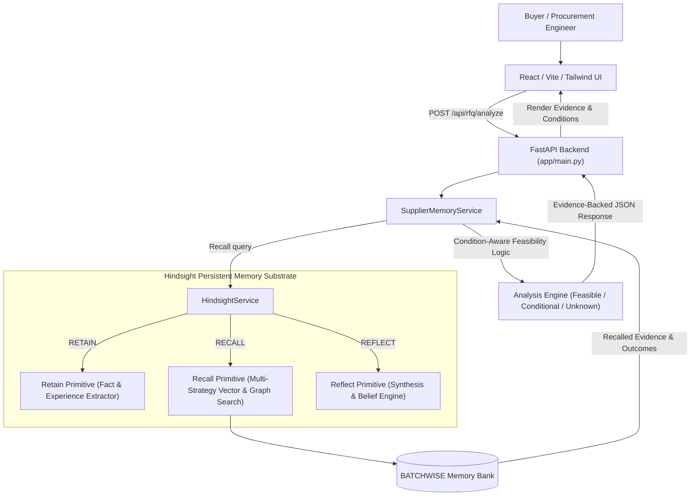

# BATCHWISE Architecture & Technical Specification

## Overview
BATCHWISE is an experience-driven supplier sourcing agent designed for small-batch manufacturing. Rather than relying on static supplier directory ratings or generic LLM prompts, BATCHWISE leverages **Hindsight persistent memory** to retain, recall, and reflect upon real historical order outcomes and operating conditions.

## Core Primitives

### 1. RETAIN (`retain_experience`)
Converts structured supplier order outcomes (supplier, product, quantity, material, process, conditions, prices, lead times, failure reasons) into natural-language memory entries retaining conditional context.

### 2. RECALL (`recall_supplier_experiences`)
Performs parallel multi-strategy search over the `batchwise_supplier_memory` bank to retrieve historical experiences relevant to the incoming RFQ's operational parameters.

### 3. REFLECT (`reflect_on_supplier_experiences`)
Synthesizes higher-level supplier capability models and recurring operational risks across historical memory items.

### 4. Anti-Hallucination & Feasibility Engine
- **`FEASIBLE`**: Historical evidence demonstrates consistent success under matching conditions.
- **`CONDITIONAL`**: Historical evidence exists but outcome depends on specific operational conditions (e.g. stock material availability or standard tooling vs custom tooling).
- **`UNKNOWN`**: Insufficient historical evidence. Explicitly refrains from guessing confidence.

## Tech Stack
- **Frontend**: React 18, Vite, TypeScript, Tailwind CSS, Lucide Icons.
- **Backend**: Python 3.13, FastAPI, Pydantic v2, Pytest, Uvicorn.
- **Memory Engine**: Official Hindsight Python Client (`hindsight-client` 0.10.1).
